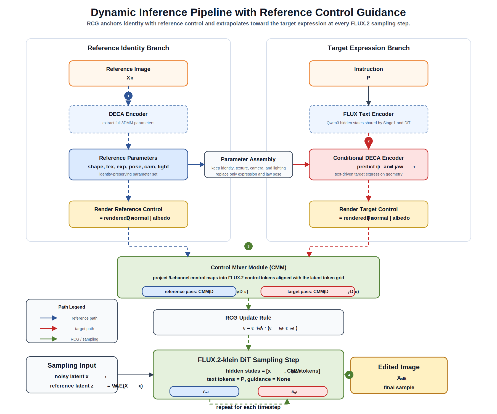

<p align="center">
  <h1 align="center">3DMM-FLUX: Instruction-Guided Facial Expression Editing</h1>
</p>

<p align="center">
  <a href="README_CN.md">中文</a> | <b>English</b>
</p>

<p align="center">
  
</p>

## Abstract

This repository implements **3DMM-FLUX**, an instruction-guided facial expression editing framework built on parametric 3D face representation and FLUX diffusion/flow matching. Given a single face image and a natural-language instruction, the system first estimates identity-aware geometry, pose, expression, camera, and illumination parameters with DECA/3DMM. It then predicts the target expression parameters, renders expression-aware geometric control signals, and injects them into the FLUX.2-klein flow-matching generation process. The framework combines interpretable 3D facial priors with high-fidelity generative modeling, aiming to improve expression controllability while preserving the input identity.

The implementation follows the control paradigm of [ControlFace (CVPR 2025)](https://github.com/cvlab-kaist/ControlFace), uses [DECA](https://github.com/yfeng95/DECA) for 3DMM parameter estimation and rendering, and adopts the official [FLUX.2-klein-base](https://huggingface.co/black-forest-labs/FLUX.2-klein-base) configuration, including its paired text encoder. Training is performed on the in-house FacePairEmoji expression-pair dataset with both Chinese and English editing instructions.

## Highlights

- **Parametric expression control**: DECA/3DMM decomposes an input face into identity, pose, expression, illumination, and camera parameters, providing explicit geometric supervision.
- **Instruction-driven editing**: Chinese and English prompts are encoded with the FLUX.2-klein text encoder and used to predict target DECA expression and jaw-pose parameters.
- **FLUX.2 flow-matching generation**: Reference and target 3DMM control maps are projected into control tokens and injected into the FLUX.2-klein transformer.
- **Identity-preserving inference**: Reference-Control Guidance (RCG) strengthens identity consistency and enables direct comparison with the vanilla FLUX.2 baseline.

<!-- demo-gallery-start -->
## Demo

The table forms a 7x7 qualitative matrix from source and target expressions, ordered as `Neutral -> Angry -> Disgust -> Fear -> Happy -> Sad -> Surprise`. Each row corresponds to one input identity, and the left column reports the original resolution. Pale-yellow diagonal cells show the input image; off-diagonal cells reference generated results under `demo_output/`. Each off-diagonal cell contains a 2x2 comparison: the top row is our controlled model (`Control-CN / Control-EN`), and the bottom row is the vanilla FLUX.2 baseline without 3DMM control (`OG-CN / OG-EN`).

<table>
<tr><th>Resolution</th><th>Neutral</th><th>Angry</th><th>Disgust</th><th>Fear</th><th>Happy</th><th>Sad</th><th>Surprise</th></tr>
<tr><td align="center"><b>2048x2048</b></td><td align="center" bgcolor="#fff7df"><b>INPUT</b><br><br><sub>Neutral</sub></td><td align="center"><table><tr><td align="center"><sub>Control-CN</sub><br></td><td align="center"><sub>Control-EN</sub><br></td></tr><tr><td align="center"><sub>OG-CN</sub><br></td><td align="center"><sub>OG-EN</sub><br></td></tr></table></td><td align="center"><table><tr><td align="center"><sub>Control-CN</sub><br></td><td align="center"><sub>Control-EN</sub><br></td></tr><tr><td align="center"><sub>OG-CN</sub><br></td><td align="center"><sub>OG-EN</sub><br></td></tr></table></td><td align="center"><table><tr><td align="center"><sub>Control-CN</sub><br></td><td align="center"><sub>Control-EN</sub><br></td></tr><tr><td align="center"><sub>OG-CN</sub><br></td><td align="center"><sub>OG-EN</sub><br></td></tr></table></td><td align="center"><table><tr><td align="center"><sub>Control-CN</sub><br></td><td align="center"><sub>Control-EN</sub><br></td></tr><tr><td align="center"><sub>OG-CN</sub><br></td><td align="center"><sub>OG-EN</sub><br></td></tr></table></td><td align="center"><table><tr><td align="center"><sub>Control-CN</sub><br></td><td align="center"><sub>Control-EN</sub><br></td></tr><tr><td align="center"><sub>OG-CN</sub><br></td><td align="center"><sub>OG-EN</sub><br></td></tr></table></td><td align="center"><table><tr><td align="center"><sub>Control-CN</sub><br></td><td align="center"><sub>Control-EN</sub><br></td></tr><tr><td align="center"><sub>OG-CN</sub><br></td><td align="center"><sub>OG-EN</sub><br></td></tr></table></td></tr>
<tr><td align="center"><b>1328x1776</b></td><td align="center"><table><tr><td align="center"><sub>Control-CN</sub><br></td><td align="center"><sub>Control-EN</sub><br></td></tr><tr><td align="center"><sub>OG-CN</sub><br></td><td align="center"><sub>OG-EN</sub><br></td></tr></table></td><td align="center" bgcolor="#fff7df"><b>INPUT</b><br><br><sub>Angry</sub></td><td align="center"><table><tr><td align="center"><sub>Control-CN</sub><br></td><td align="center"><sub>Control-EN</sub><br></td></tr><tr><td align="center"><sub>OG-CN</sub><br></td><td align="center"><sub>OG-EN</sub><br></td></tr></table></td><td align="center"><table><tr><td align="center"><sub>Control-CN</sub><br></td><td align="center"><sub>Control-EN</sub><br></td></tr><tr><td align="center"><sub>OG-CN</sub><br></td><td align="center"><sub>OG-EN</sub><br></td></tr></table></td><td align="center"><table><tr><td align="center"><sub>Control-CN</sub><br></td><td align="center"><sub>Control-EN</sub><br></td></tr><tr><td align="center"><sub>OG-CN</sub><br></td><td align="center"><sub>OG-EN</sub><br></td></tr></table></td><td align="center"><table><tr><td align="center"><sub>Control-CN</sub><br></td><td align="center"><sub>Control-EN</sub><br></td></tr><tr><td align="center"><sub>OG-CN</sub><br></td><td align="center"><sub>OG-EN</sub><br></td></tr></table></td><td align="center"><table><tr><td align="center"><sub>Control-CN</sub><br></td><td align="center"><sub>Control-EN</sub><br></td></tr><tr><td align="center"><sub>OG-CN</sub><br></td><td align="center"><sub>OG-EN</sub><br></td></tr></table></td></tr>
<tr><td align="center"><b>1184x1392</b></td><td align="center"><table><tr><td align="center"><sub>Control-CN</sub><br></td><td align="center"><sub>Control-EN</sub><br></td></tr><tr><td align="center"><sub>OG-CN</sub><br></td><td align="center"><sub>OG-EN</sub><br></td></tr></table></td><td align="center"><table><tr><td align="center"><sub>Control-CN</sub><br></td><td align="center"><sub>Control-EN</sub><br></td></tr><tr><td align="center"><sub>OG-CN</sub><br></td><td align="center"><sub>OG-EN</sub><br></td></tr></table></td><td align="center" bgcolor="#fff7df"><b>INPUT</b><br><br><sub>Disgust</sub></td><td align="center"><table><tr><td align="center"><sub>Control-CN</sub><br></td><td align="center"><sub>Control-EN</sub><br></td></tr><tr><td align="center"><sub>OG-CN</sub><br></td><td align="center"><sub>OG-EN</sub><br></td></tr></table></td><td align="center"><table><tr><td align="center"><sub>Control-CN</sub><br></td><td align="center"><sub>Control-EN</sub><br></td></tr><tr><td align="center"><sub>OG-CN</sub><br></td><td align="center"><sub>OG-EN</sub><br></td></tr></table></td><td align="center"><table><tr><td align="center"><sub>Control-CN</sub><br></td><td align="center"><sub>Control-EN</sub><br></td></tr><tr><td align="center"><sub>OG-CN</sub><br></td><td align="center"><sub>OG-EN</sub><br></td></tr></table></td><td align="center"><table><tr><td align="center"><sub>Control-CN</sub><br></td><td align="center"><sub>Control-EN</sub><br></td></tr><tr><td align="center"><sub>OG-CN</sub><br></td><td align="center"><sub>OG-EN</sub><br></td></tr></table></td></tr>
<tr><td align="center"><b>832x1248</b></td><td align="center"><table><tr><td align="center"><sub>Control-CN</sub><br></td><td align="center"><sub>Control-EN</sub><br></td></tr><tr><td align="center"><sub>OG-CN</sub><br></td><td align="center"><sub>OG-EN</sub><br></td></tr></table></td><td align="center"><table><tr><td align="center"><sub>Control-CN</sub><br></td><td align="center"><sub>Control-EN</sub><br></td></tr><tr><td align="center"><sub>OG-CN</sub><br></td><td align="center"><sub>OG-EN</sub><br></td></tr></table></td><td align="center"><table><tr><td align="center"><sub>Control-CN</sub><br></td><td align="center"><sub>Control-EN</sub><br></td></tr><tr><td align="center"><sub>OG-CN</sub><br></td><td align="center"><sub>OG-EN</sub><br></td></tr></table></td><td align="center" bgcolor="#fff7df"><b>INPUT</b><br><br><sub>Fear</sub></td><td align="center"><table><tr><td align="center"><sub>Control-CN</sub><br></td><td align="center"><sub>Control-EN</sub><br></td></tr><tr><td align="center"><sub>OG-CN</sub><br></td><td align="center"><sub>OG-EN</sub><br></td></tr></table></td><td align="center"><table><tr><td align="center"><sub>Control-CN</sub><br></td><td align="center"><sub>Control-EN</sub><br></td></tr><tr><td align="center"><sub>OG-CN</sub><br></td><td align="center"><sub>OG-EN</sub><br></td></tr></table></td><td align="center"><table><tr><td align="center"><sub>Control-CN</sub><br></td><td align="center"><sub>Control-EN</sub><br></td></tr><tr><td align="center"><sub>OG-CN</sub><br></td><td align="center"><sub>OG-EN</sub><br></td></tr></table></td></tr>
<tr><td align="center"><b>656x896</b></td><td align="center"><table><tr><td align="center"><sub>Control-CN</sub><br></td><td align="center"><sub>Control-EN</sub><br></td></tr><tr><td align="center"><sub>OG-CN</sub><br></td><td align="center"><sub>OG-EN</sub><br></td></tr></table></td><td align="center"><table><tr><td align="center"><sub>Control-CN</sub><br></td><td align="center"><sub>Control-EN</sub><br></td></tr><tr><td align="center"><sub>OG-CN</sub><br></td><td align="center"><sub>OG-EN</sub><br></td></tr></table></td><td align="center"><table><tr><td align="center"><sub>Control-CN</sub><br></td><td align="center"><sub>Control-EN</sub><br></td></tr><tr><td align="center"><sub>OG-CN</sub><br></td><td align="center"><sub>OG-EN</sub><br></td></tr></table></td><td align="center"><table><tr><td align="center"><sub>Control-CN</sub><br></td><td align="center"><sub>Control-EN</sub><br></td></tr><tr><td align="center"><sub>OG-CN</sub><br></td><td align="center"><sub>OG-EN</sub><br></td></tr></table></td><td align="center" bgcolor="#fff7df"><b>INPUT</b><br><br><sub>Happy</sub></td><td align="center"><table><tr><td align="center"><sub>Control-CN</sub><br></td><td align="center"><sub>Control-EN</sub><br></td></tr><tr><td align="center"><sub>OG-CN</sub><br></td><td align="center"><sub>OG-EN</sub><br></td></tr></table></td><td align="center"><table><tr><td align="center"><sub>Control-CN</sub><br></td><td align="center"><sub>Control-EN</sub><br></td></tr><tr><td align="center"><sub>OG-CN</sub><br></td><td align="center"><sub>OG-EN</sub><br></td></tr></table></td></tr>
<tr><td align="center"><b>448x592</b></td><td align="center"><table><tr><td align="center"><sub>Control-CN</sub><br></td><td align="center"><sub>Control-EN</sub><br></td></tr><tr><td align="center"><sub>OG-CN</sub><br></td><td align="center"><sub>OG-EN</sub><br></td></tr></table></td><td align="center"><table><tr><td align="center"><sub>Control-CN</sub><br></td><td align="center"><sub>Control-EN</sub><br></td></tr><tr><td align="center"><sub>OG-CN</sub><br></td><td align="center"><sub>OG-EN</sub><br></td></tr></table></td><td align="center"><table><tr><td align="center"><sub>Control-CN</sub><br></td><td align="center"><sub>Control-EN</sub><br></td></tr><tr><td align="center"><sub>OG-CN</sub><br></td><td align="center"><sub>OG-EN</sub><br></td></tr></table></td><td align="center"><table><tr><td align="center"><sub>Control-CN</sub><br></td><td align="center"><sub>Control-EN</sub><br></td></tr><tr><td align="center"><sub>OG-CN</sub><br></td><td align="center"><sub>OG-EN</sub><br></td></tr></table></td><td align="center"><table><tr><td align="center"><sub>Control-CN</sub><br></td><td align="center"><sub>Control-EN</sub><br></td></tr><tr><td align="center"><sub>OG-CN</sub><br></td><td align="center"><sub>OG-EN</sub><br></td></tr></table></td><td align="center" bgcolor="#fff7df"><b>INPUT</b><br><br><sub>Sad</sub></td><td align="center"><table><tr><td align="center"><sub>Control-CN</sub><br></td><td align="center"><sub>Control-EN</sub><br></td></tr><tr><td align="center"><sub>OG-CN</sub><br></td><td align="center"><sub>OG-EN</sub><br></td></tr></table></td></tr>
<tr><td align="center"><b>256x256</b></td><td align="center"><table><tr><td align="center"><sub>Control-CN</sub><br></td><td align="center"><sub>Control-EN</sub><br></td></tr><tr><td align="center"><sub>OG-CN</sub><br></td><td align="center"><sub>OG-EN</sub><br></td></tr></table></td><td align="center"><table><tr><td align="center"><sub>Control-CN</sub><br></td><td align="center"><sub>Control-EN</sub><br></td></tr><tr><td align="center"><sub>OG-CN</sub><br></td><td align="center"><sub>OG-EN</sub><br></td></tr></table></td><td align="center"><table><tr><td align="center"><sub>Control-CN</sub><br></td><td align="center"><sub>Control-EN</sub><br></td></tr><tr><td align="center"><sub>OG-CN</sub><br></td><td align="center"><sub>OG-EN</sub><br></td></tr></table></td><td align="center"><table><tr><td align="center"><sub>Control-CN</sub><br></td><td align="center"><sub>Control-EN</sub><br></td></tr><tr><td align="center"><sub>OG-CN</sub><br></td><td align="center"><sub>OG-EN</sub><br></td></tr></table></td><td align="center"><table><tr><td align="center"><sub>Control-CN</sub><br></td><td align="center"><sub>Control-EN</sub><br></td></tr><tr><td align="center"><sub>OG-CN</sub><br></td><td align="center"><sub>OG-EN</sub><br></td></tr></table></td><td align="center"><table><tr><td align="center"><sub>Control-CN</sub><br></td><td align="center"><sub>Control-EN</sub><br></td></tr><tr><td align="center"><sub>OG-CN</sub><br></td><td align="center"><sub>OG-EN</sub><br></td></tr></table></td><td align="center" bgcolor="#fff7df"><b>INPUT</b><br><br><sub>Surprise</sub></td></tr>
</table>

<!-- demo-gallery-end -->

## 1. Environment

We recommend the `controlface310` conda environment with CUDA 12.1 and PyTorch 2.5.1:

```bash
conda create -n controlface310 python=3.10 -y
conda activate controlface310

pip install --no-cache-dir torch==2.5.1 torchvision==0.20.1 torchaudio==2.5.1 \
    --index-url https://download.pytorch.org/whl/cu121

pip install -U setuptools wheel ninja cmake
conda install -y -c fvcore -c iopath -c conda-forge fvcore iopath
conda install -y -c conda-forge mpi4py dlib scikit-learn "scikit-image<0.25" tqdm

pip install -r requirements.txt
```

The same setup commands are collected in `set_env.sh`:

```bash
bash set_env.sh
```

### PyTorch3D Installation

The DECA renderer uses `pytorch3d`. For PyTorch 2.5, installing PyTorch3D from source is recommended:

```bash
git clone https://github.com/facebookresearch/pytorch3d.git
cd pytorch3d
pip install --no-build-isolation -e .
```

### DECA Setup

Required pretrained assets:

| Asset | Target path | Note |
|---|---|---|
| `deca_model.tar` | `data/deca_model.tar` | DECA pretrained checkpoint |
| `generic_model.pkl` | `data/generic_model.pkl` | FLAME 2020 model |
| `FLAME_texture.npz` | `data/FLAME_texture.npz` | FLAME texture space |
| `head_template.obj`, `uv_face_eye_mask.png`, `fixed_displacement_256.npy`, `mean_texture.jpg` | `data/` | DECA static assets |

### FLUX.2-klein-base

Download `black-forest-labs/FLUX.2-klein-base-4B` in Diffusers format and point the corresponding yaml fields to the local model directory.

## 2. Data Preparation

### 2.1 Download Preprocessed Dataset (FacePairEmoji)

The released FacePairEmoji dataset is available at [`yunpengZhangup/FacePairEmoji`](https://huggingface.co/datasets/yunpengZhangup/FacePairEmoji). It contains the processed image folders, instruction jsonl files, and pre-extracted DECA parameters, so you can train directly without regenerating the metadata or DECA features:

```bash
hf download yunpengZhangup/FacePairEmoji --repo-type=dataset \
  --local-dir ./face_emoji
```

The downloaded directory should follow this layout:

```text
face_emoji/
  raf_pairs_with_instructions.jsonl
  v1_pairs_with_instructions.jsonl
  deca_params/
    raf/
    v1/
  final_data_raf_bucket_postprocessed/
  final_data_v1_bucket_postprocessed/
```

The default `configs/stage1.yaml` and `configs/stage2.yaml` point to this `./face_emoji/...` layout. For full training runs, absolute paths are recommended for `data.sources[*].jsonl`, `data.sources[*].src_root`, and `data.sources[*].params_root`, especially when launching jobs from different working directories:

```yaml
data:
  sources:
    - jsonl: /abs/path/to/ControlFace-main/face_emoji/v1_pairs_with_instructions.jsonl
      src_root: /abs/path/to/ControlFace-main/face_emoji/final_data_v1_bucket_postprocessed
      params_root: /abs/path/to/ControlFace-main/face_emoji/deca_params/v1
    - jsonl: /abs/path/to/ControlFace-main/face_emoji/raf_pairs_with_instructions.jsonl
      src_root: /abs/path/to/ControlFace-main/face_emoji/final_data_raf_bucket_postprocessed
      params_root: /abs/path/to/ControlFace-main/face_emoji/deca_params/raf
```

The image paths stored in the jsonl files and the `src_root` values in the yaml files must use the same root convention. If you convert yaml paths to absolute paths, it is safer to convert `image_a_path` and `image_b_path` in the jsonl files to absolute paths as well; otherwise the dataset loader may fail to map an image path to the corresponding `.pt` file under `params_root`.

### 2.2 Generate Expression-Pair JSONL

If you want to use your own dataset, organize it as `<root>/<bucket>/<expression>/<prefix>_<id>.<ext>`, then generate expression-pair metadata:

```bash
python scripts/generate_pairs_jsonl.py \
  --data_dir ./face_emoji/final_data_raf_bucket_postprocessed \
  --output ./raf_pairs.jsonl

python scripts/generate_pairs_jsonl.py \
  --data_dir ./face_emoji/final_data_v1_bucket_postprocessed \
  --output ./v1_pairs.jsonl
```

### 2.3 LLM Quality Filtering and Instruction Generation

The quality-filtering and instruction-generation stage is released as prompt templates under `prompts/`. API credentials and vendor-specific request code are intentionally not stored in this repository; connect the templates to your preferred multimodal or text LLM provider when reproducing this step.

### 2.4 Offline DECA Parameter Extraction

If you do not use the released pre-extracted DECA parameters, extract them offline before training:

```bash
bash scripts/run_extract_multigpu.sh
```

### 2.5 Verify Extracted Parameters

Verify the extracted parameters:

```bash
python scripts/verify_deca_params.py \
  --src_root ./face_emoji/final_data_raf_bucket_postprocessed \
  --out_root ./face_emoji/deca_params/raf \
  --src_root ./face_emoji/final_data_v1_bucket_postprocessed \
  --out_root ./face_emoji/deca_params/v1 \
  --deep_check
```

## 3. Stage-1 Training

<p align="center">
  
</p>

Stage 1 trains a text-conditioned DECA expression encoder:

- Input: reference face image and text instruction.
- Output: target expression coefficients `exp[:50]` and jaw pose `pose[3:6]`.
- Supervision: offline DECA parameters extracted from the target image.
- Text encoder: the official FLUX.2-klein Qwen3 encoder, concatenating hidden states from layers 9, 18, and 27.

Configuration: [`configs/stage1.yaml`](configs/stage1.yaml)

```bash
bash train/train_stage1.sh
```

The best checkpoint is saved under `checkpoints/stage1/stage1-<timestamp>/best-step-{N}.pt`.

## 4. Stage-2 Training

<p align="center">
  
</p>

Stage 2 jointly trains the FLUX.2 control pathway:

1. Stage 1 predicts target DECA expression and jaw parameters.
2. DECA renders reference and target control maps, including rendered image, normal, and albedo channels.
3. `Flux2ControlMixer` projects the control maps into tokens and injects them into the FLUX.2 transformer.
4. Flow-matching loss supervises generation in the FLUX.2 latent space, with an auxiliary Stage-1 loss for expression consistency.

Configuration: [`configs/stage2.yaml`](configs/stage2.yaml)

```bash
bash train/train_stage2.sh
```

The resulting checkpoint is saved under `checkpoints/stage2/stage2-<timestamp>/best-step-{N}.pt` and contains `stage1_model`, `control_mixer`, configuration snapshots, and training step metadata.

## 5. Inference

<p align="center">
  
</p>

### 5.1 Reference Control Guidance (RCG)

At inference time, the system renders two control conditions. The reference control `D_R` is rendered from the complete DECA parameters of the reference image, while the target control `D_T` only replaces expression and jaw parameters predicted by Stage 1; identity, texture, camera, and lighting remain inherited from the reference image. The Control Mixer then performs two forward passes:

```text
eps_ref = DiT(cat(latents, ref_latents, CMM(D_R, D_R)), text)
eps_tgt = DiT(cat(latents, ref_latents, CMM(D_T, D_R)), text)
eps     = eps_ref + lambda * (eps_tgt - eps_ref)
```

| lambda | Behavior |
|---|---|
| 0.0 | nearly unchanged reference image |
| 1.0 | equivalent to the target branch without RCG |
| 3.0 | default, clear expression editing with stable identity |
| >3 | stronger expression, with higher identity-drift risk |

RCG uses reference control as the identity anchor and amplifies the target-reference difference direction. The coefficient `lambda` controls the expression strength.

### 5.2 Stage-1 Inference

Stage-1 visualization renders the predicted 3DMM control maps:

```bash
python infer/infer_stage1.py \
  --config configs/stage1.yaml \
  --ckpt ./checkpoints/stage1/stage1-<timestamp>/best-step-{N}.pt \
  --ref ./demo_input/256*256_surprise/raf_train_10109.png \
  --prompt "make the person look happy" \
  --output_dir ./output_stage1_demo
```

### 5.3 Stage-2 Inference

End-to-end FLUX.2 expression editing:

```bash
python infer/infer_stage2.py \
  --config configs/infer_stage2.yaml \
  --ref ./demo_input/256*256_surprise/raf_train_10109.png \
  --prompt "make the person look happy" \
  --output_dir ./output_stage2_demo
```

The default output directory contains `final.png`, rendered reference/target control maps, optional intermediate tensors, and `summary.json`.

## 6. Configuration Files

| File | Purpose |
|---|---|
| [`configs/stage1.yaml`](configs/stage1.yaml) | Stage-1 data sources, model paths, optimization, losses, and checkpoint policy |
| [`configs/stage2.yaml`](configs/stage2.yaml) | Stage-2 FLUX.2 control-mixer training and Stage-1 checkpoint binding |
| [`configs/infer_stage2.yaml`](configs/infer_stage2.yaml) | End-to-end inference, FLUX.2 sampling options, RCG coefficient, and output settings |

All fields can also be overridden from the command line with `--opts key=val`.

## 7. Repository Structure

```text
ControlFace-main/
├── configs/              # YAML configs for training and inference
├── data/                 # DECA static assets
├── decalib/              # DECA encoder, FLAME, and renderer code
├── infer/                # Stage-1 and Stage-2 inference scripts
├── prompts/              # Prompt templates
├── scripts/              # Data preparation and DECA parameter extraction utilities
├── src/                  # Datasets, losses, and model modules
├── train/                # Stage-1 and Stage-2 training entry points
├── demo_input/           # Example input images used by the README gallery
├── demo_output/          # Example generated results used by the README gallery
├── requirements.txt
├── set_env.sh
├── README.md
└── README_CN.md
```

## Acknowledgements

This project builds on the following open-source works:

- [ControlFace (CVPR 2025)](https://github.com/cvlab-kaist/ControlFace)
- [DECA](https://github.com/yfeng95/DECA) and [DiffusionRig](https://github.com/adobe-research/diffusion-rig)
- [FLUX.2-klein-base](https://huggingface.co/black-forest-labs/FLUX.2-klein-base)
- [face-alignment (FAN)](https://github.com/1adrianb/face-alignment)
